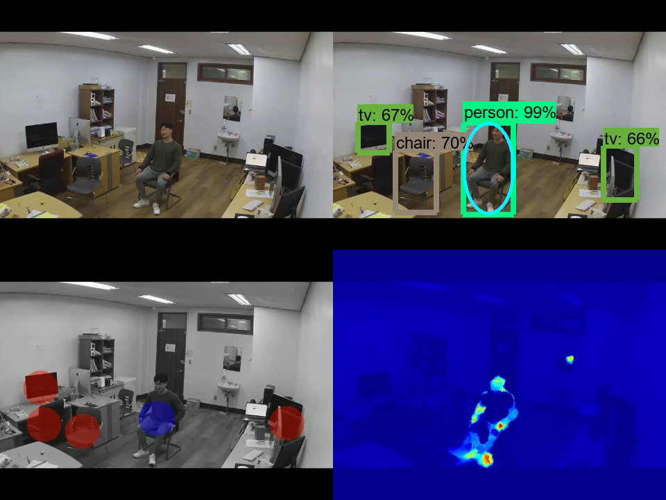
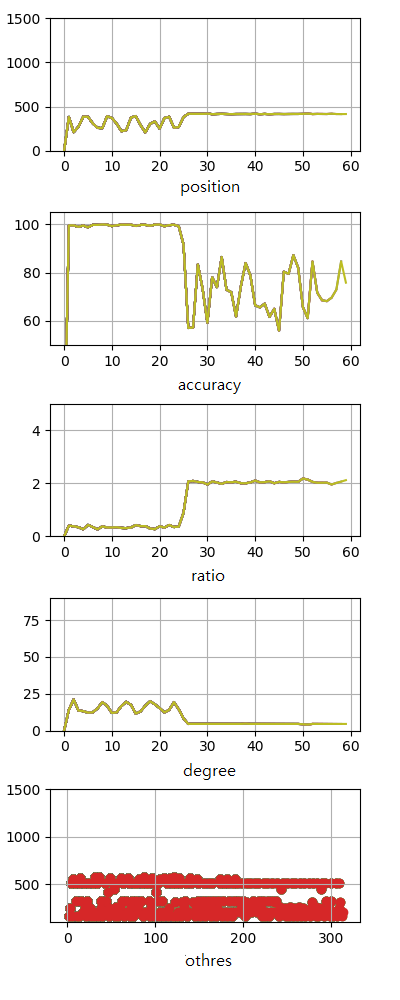

# ObjectDetection-Project(PaperCode)

Source code used in the paper

1. Unusual Event Detection Algorithm via Personalized Daily Activity and Vision Patterns for Single Households
2. Personalized Unusual Event Detection Algorithm at Smart Home via Daily Activity and Vision Pattern
3. 고독사 예방을 위한 영상 및 음성패턴 기반 맞춤형 이상 징후 탐지 알고리즘

